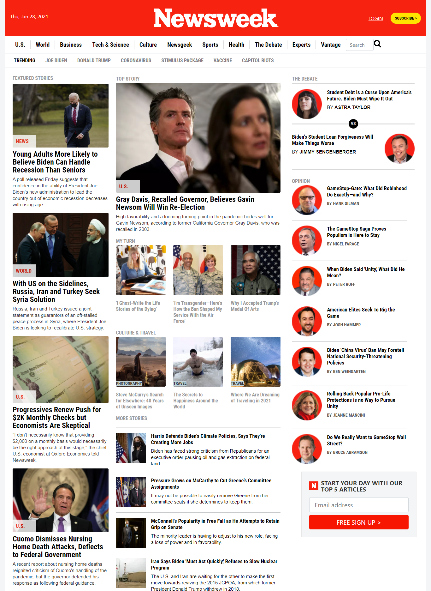

# Newsweek-Replica

> This is the sixth collaborative project from Microverse program, It's a clone of Newsweek website, built with HTML and CSS3 languages using Bootstrap 5 framework.

## 🔧 Built With

- HTML and CSS3.
- Using UX.
- Using floats and flexbox.
- Using framework Bootstrap.
- Using StyleLinters.
- W3 HTML Validation Service.

## 🔴 Live Demo

[Live Demo Link](https://danielufeli.github.io/newsweek-replica/.)

## 🛠 Getting Started

To get a local copy up and running follow these simple example steps.

- Go to the main page of the repo.
- Press the "Code" button and get the repo link.
- git clone.

## ✒️ Author

👤 **Daniel Ufeli**

- Github: [@danielufeli](https://github.com/danielufeli)
- Twitter: [@danielufeli](https://twitter.com/danielufeli)
- Linkedin: [linkedin](https://www.linkedin.com/in/danielufeli/)

## 🤝 Contributing

Contributions, issues and feature requests are welcome!

Feel free to check the [issues page](issues/).

## 📝 License

This project is [MIT](LICENSE.url) licensed.
